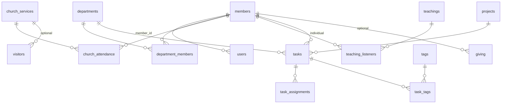

# SysteMIC Church Backoffice — PostgreSQL / Supabase Public Schema

This document describes the **current end state** of the `public` schema used by the Flutter backoffice app. It is assembled from:

- Root-level SQL scripts (`CREATE_*`, `ADD_*`, `MIGRATE_*`, `ALTER_*`, `RECREATE_*`, `ENABLE_RLS_*`, `FIX_*`, `SYNC_*`, etc.)
- `supabase/migrations/20260716140000_migrate_church_services.sql` (same content as `MIGRATE_CHURCH_SERVICES.sql`)
- Column usage in `lib/services/*.dart` (inserts, selects, updates)

A consolidated DDL reference lives in [`schema.sql`](schema.sql). For a fresh database, run `schema.sql` then apply RLS policy scripts (`ENABLE_RLS_ALL_TABLES.sql` and feature-specific policy files).

---

## Project overview

**SysteMIC** is a church management backoffice backed by **Supabase** (PostgreSQL + Auth + Storage). The app manages members, departments, training classes, events, church service attendance, visitors, teachings, tasks/projects, finance (giving), notifications, and leader permissions.

**Conventions**

- Primary keys are **UUID** (`gen_random_uuid()`).
- **Soft deletes** use `deleted_at` and/or `is_active = false` depending on the table.
- **`users.id`** aligns with **`auth.users.id`** when the auth sync trigger is installed (`SYNC_AUTH_USERS_TO_USERS_TABLE.sql`).
- **`members.role`** (member/worker/leader/…) differs from **`users.role`** (app login role: admin/leader/member).

---

## Entity relationship overview

| Domain | Central tables | Related tables |
|--------|----------------|----------------|
| Auth | `users` | `user_devices`, `leader_access` |
| Members | `members` | `new_comers`, `department_members` |
| Departments | `departments` | `department_members`, `department_reports`, `service_schedules` |
| Training | `classes` | `class_members`, `sessions`, `attendance` |
| Events | `events` | `event_sessions`, `event_registrations`, `event_attendance` |
| Church attendance | `church_services` | `church_attendance`, `visitors` |
| Sunday school | `sunday_school_attendance` | → `members` |
| Teachings | `teachings` | `teaching_listeners`, `tasks` (auto-tasks) |
| Tasks | `tasks` | `task_assignments`, `projects`, `tags`, `task_tags`, penalties |
| Finance | `giving` | → `members` (optional) |
| Comms | `announcements`, `notifications` | → `members`, `users` |
| Settings | `app_settings` | JSON config (e.g. birthdays) |

---

## Enums and CHECK constraints

| Name | Values | Used on |
|------|--------|---------|
| `giving_tag_enum` | `construction`, `special_op`, `tithe`, `offering`, `gift`, `other` | `giving.tag` |
| (CHECK) | `expense`, `receiving` | `giving.type` |
| (CHECK) | `onsite`, `online`, `absent` | `church_attendance.attendance_type`, `visitors.attendance_type` |
| (CHECK) | `admin`, `leader`, `member`, `worker`, `sympathiser` | `members.role` |
| (CHECK) | `wants_to_stay`, `does_not_know_yet`, `just_passing` | `members.newcomer_intention`, `new_comers.newcomer_intention` |
| (CHECK) | profession enum (5 values) | `members.profession` |
| (CHECK) | `leader`, `subleader`, `member` | `department_members.role` |
| (CHECK) | task priority / status | `tasks`, `task_assignments`, `projects` |
| (CHECK) | `mid`, `short`, `full` | `tasks.teaching_task_type` |
| (CHECK) | media roles (5 values) | `service_schedule_assignments.role` |
| (CHECK) | member XOR guest | `event_registrations` |
| (CHECK) | department XOR member | `tasks` (exactly one of `department_id`, `member_id`) |

**Removed (post-migration):** `church_attendance.service_type`, `visitors.service_type` — replaced by `church_service_id` (`MIGRATE_CHURCH_SERVICES.sql`).

---

## Auth & users

### `users`

App profile row; synced from Supabase Auth.

| Column | Type | Null | Default | FK | Notes |
|--------|------|------|---------|-----|-------|
| `id` | UUID | NO | — | PK; matches `auth.users.id` | |
| `email` | TEXT | YES | — | | |
| `phone` | TEXT | YES | — | | |
| `role` | TEXT | NO | `'member'` | | App login role (`admin`, `leader`, `member`, …) |
| `member_id` | UUID | YES | — | → `members.id` | |
| `is_active` | BOOLEAN | NO | `true` | | Inactive hidden from most RLS |
| `must_change_password` | BOOLEAN | NO | `false` | | Used on login (`auth_service.dart`) |
| `created_at` | TIMESTAMPTZ | NO | `NOW()` | | |
| `updated_at` | TIMESTAMPTZ | NO | `NOW()` | | |

### `user_devices`

FCM push tokens (`device_token_service.dart`).

| Column | Type | Null | Default | FK | Notes |
|--------|------|------|---------|-----|-------|
| `id` | UUID | NO | `gen_random_uuid()` | PK | |
| `user_id` | UUID | NO | — | → `users.id` | |
| `device_token` | TEXT | NO | — | | |
| `platform` | TEXT | YES | — | | e.g. `mobile` |
| `created_at` | TIMESTAMPTZ | NO | `NOW()` | | |
| `updated_at` | TIMESTAMPTZ | NO | `NOW()` | | |

**Unique:** `(user_id, device_token)`.

### `leader_access`

Granular feature permissions per leader user (`CREATE_LEADER_ACCESS_TABLE.sql`).

| Column | Type | Null | Default | FK | Notes |
|--------|------|------|---------|-----|-------|
| `id` | UUID | NO | `gen_random_uuid()` | PK | |
| `user_id` | UUID | NO | — | → `users.id` | |
| `feature_name` | TEXT | NO | — | | e.g. `members`, `visitors`, `giving` |
| `can_view` | BOOLEAN | NO | `false` | | |
| `can_create` | BOOLEAN | NO | `false` | | |
| `can_edit` | BOOLEAN | NO | `false` | | |
| `can_delete` | BOOLEAN | NO | `false` | | |
| `created_by` | UUID | YES | — | → `users.id` | |
| `created_at` | TIMESTAMPTZ | NO | `NOW()` | | |
| `updated_at` | TIMESTAMPTZ | NO | `NOW()` | | |
| `deleted_at` | TIMESTAMPTZ | YES | — | | Soft delete |

**Unique:** `(user_id, feature_name)`.

---

## Members

### `members`

Core person record. Columns from SQL alters + member forms/services.

| Column | Type | Null | Default | FK | Notes |
|--------|------|------|---------|-----|-------|
| `id` | UUID | NO | `gen_random_uuid()` | PK | |
| `first_name` | TEXT | NO | — | | |
| `last_name` | TEXT | NO | — | | |
| `email` | TEXT | YES | — | | |
| `phone` | TEXT | YES | — | | Normalized in app |
| `birthday` | DATE | YES | — | | Required in UI |
| `address` | TEXT | YES | — | | |
| `city` | TEXT | YES | — | | |
| `state` | TEXT | YES | — | | |
| `zip_code` | TEXT | YES | — | | |
| `country` | TEXT | YES | — | | |
| `quarter` | TEXT | YES | — | | `ADD_MEMBER_ADDITIONAL_FIELDS.sql` |
| `profession` | TEXT | YES | — | | CHECK (5 values) |
| `level_of_study` | TEXT | YES | — | | |
| `sector_of_studies` | TEXT | YES | — | | |
| `domain_of_activity` | TEXT | YES | — | | |
| `key_skills` | TEXT[] | YES | — | | |
| `last_diplomas` | TEXT | YES | — | | |
| `gender` | TEXT | YES | — | | App form |
| `marital_status` | TEXT | YES | — | | App form |
| `role` | TEXT | NO | `'member'` | | CHECK incl. worker, sympathiser |
| `department_id` | UUID | YES | — | → `departments.id` | Filter in members list |
| `is_new_comer` | BOOLEAN | NO | `false` | | Auto-cleared after 9 attendances / 90 days |
| `newcomer_join_date` | DATE | YES | — | | |
| `newcomer_intention` | TEXT | YES | — | | CHECK (3 values) |
| `is_active` | BOOLEAN | NO | `true` | | |
| `birthday_notifications_opt_out` | BOOLEAN | NO | `false` | | |
| `photo_url` | TEXT | YES | — | | Storage `member-photos` |
| `created_at` | TIMESTAMPTZ | NO | `NOW()` | | |
| `updated_at` | TIMESTAMPTZ | NO | `NOW()` | | |
| `deleted_at` | TIMESTAMPTZ | YES | — | | Soft delete (`member_service.dart`) |

### `new_comers`

Historical newcomer rows for reporting (`CREATE_NEW_COMERS_TABLE.sql`).

| Column | Type | Null | Default | FK | Notes |
|--------|------|------|---------|-----|-------|
| `id` | UUID | NO | `gen_random_uuid()` | PK | |
| `member_id` | UUID | YES | — | → `members.id` | Nullable for visitor-only history |
| `first_name` | TEXT | YES | — | | |
| `last_name` | TEXT | YES | — | | |
| `email` | TEXT | YES | — | | |
| `phone` | TEXT | YES | — | | |
| `newcomer_join_date` | DATE | NO | `CURRENT_DATE` | | |
| `newcomer_intention` | TEXT | YES | — | | CHECK (3 values) |
| `created_by` | UUID | YES | — | → `users.id` | |
| `created_at` | TIMESTAMPTZ | NO | `NOW()` | | |
| `updated_at` | TIMESTAMPTZ | NO | `NOW()` | | |
| `deleted_at` | TIMESTAMPTZ | YES | — | | |

---

## Departments

### `departments`

| Column | Type | Null | Default | FK | Notes |
|--------|------|------|---------|-----|-------|
| `id` | UUID | NO | `gen_random_uuid()` | PK | |
| `name` | TEXT | NO | — | | Finance dept name used for giving RLS |
| `description` | TEXT | YES | — | | |
| `is_active` | BOOLEAN | NO | `true` | | Soft delete |
| `document_1_url` … `document_3_name` | TEXT | YES | — | | `ADD_DEPARTMENT_DOCUMENTS.sql` |
| `task_penalty_amount` | INTEGER | YES | — | | Override per dept (`ADD_TASK_PENALTIES…`) |
| `created_at` | TIMESTAMPTZ | NO | `NOW()` | | |
| `updated_at` | TIMESTAMPTZ | NO | `NOW()` | | |

### `department_members`

| Column | Type | Null | Default | FK | Notes |
|--------|------|------|---------|-----|-------|
| `id` | UUID | NO | `gen_random_uuid()` | PK | |
| `department_id` | UUID | NO | — | → `departments.id` | |
| `member_id` | UUID | NO | — | → `members.id` | |
| `role` | TEXT | NO | `'member'` | | `leader`, `subleader`, `member` |
| `is_main` | BOOLEAN | NO | `false` | | One main dept per worker |
| `created_at` | TIMESTAMPTZ | NO | `NOW()` | | |
| `updated_at` | TIMESTAMPTZ | NO | `NOW()` | | |

**Unique:** `(department_id, member_id)`. **Partial unique:** one `is_main = true` per `member_id`.

### `department_reports`

| Column | Type | Null | Default | FK | Notes |
|--------|------|------|---------|-----|-------|
| `id` | UUID | NO | `gen_random_uuid()` | PK | |
| `department_id` | UUID | NO | — | → `departments.id` | |
| `created_by` | UUID | NO | — | → `users.id` | |
| `title` | TEXT | NO | — | | |
| `defined_objectives` | TEXT | NO | — | | |
| `positive_points` | TEXT | NO | — | | |
| `difficulties_encountered` | TEXT | NO | — | | |
| `suggestions` | TEXT | NO | — | | |
| `comments` | TEXT | YES | — | | |
| `created_at` | TIMESTAMPTZ | NO | `NOW()` | | |
| `updated_at` | TIMESTAMPTZ | NO | `NOW()` | | |
| `deleted_at` | TIMESTAMPTZ | YES | — | | |

### `service_schedules` / `service_schedule_assignments`

Media team planning (`CREATE_SERVICE_SCHEDULE_TABLE.sql`).

**service_schedules:** `department_id`, `service_date`, `notes`, `created_by`, timestamps. **Unique:** `(department_id, service_date)`.

**service_schedule_assignments:** `schedule_id`, `role` (5 media roles), `member_id`, `is_done`, `created_at`. **Unique:** `(schedule_id, role, member_id)`.

---

## Training (classes)

### `classes`

| Column | Type | Null | Default | FK | Notes |
|--------|------|------|---------|-----|-------|
| `id` | UUID | NO | `gen_random_uuid()` | PK | |
| `name` | TEXT | NO | — | | |
| `description` | TEXT | YES | — | | |
| `department_id` | UUID | YES | — | → `departments.id` | |
| `is_active` | BOOLEAN | NO | `true` | | |
| `created_at` | TIMESTAMPTZ | NO | `NOW()` | | |
| `updated_at` | TIMESTAMPTZ | NO | `NOW()` | | |

### `class_members`

| Column | Type | Null | Default | FK | Notes |
|--------|------|------|---------|-----|-------|
| `id` | UUID | NO | `gen_random_uuid()` | PK | |
| `class_id` | UUID | NO | — | → `classes.id` | |
| `member_id` | UUID | NO | — | → `members.id` | |
| `enrolled_at` | TIMESTAMPTZ | YES | — | | |
| `created_at` | TIMESTAMPTZ | NO | `NOW()` | | |
| `updated_at` | TIMESTAMPTZ | YES | `NOW()` | | `ADD_CLASS_MEMBERS_UPDATED_AT.sql` |

### `sessions`

| Column | Type | Null | Default | FK | Notes |
|--------|------|------|---------|-----|-------|
| `id` | UUID | NO | `gen_random_uuid()` | PK | |
| `class_id` | UUID | NO | — | → `classes.id` | |
| `session_date` | TIMESTAMPTZ | NO | — | | |
| `created_at` | TIMESTAMPTZ | NO | `NOW()` | | |
| `updated_at` | TIMESTAMPTZ | NO | `NOW()` | | |

### `attendance` (class session)

| Column | Type | Null | Default | FK | Notes |
|--------|------|------|---------|-----|-------|
| `id` | UUID | NO | `gen_random_uuid()` | PK | |
| `session_id` | UUID | NO | — | → `sessions.id` | |
| `member_id` | UUID | NO | — | → `members.id` | |
| `status` | TEXT | NO | — | | e.g. present, absent, late |
| `notes` | TEXT | YES | — | | |
| `created_at` | TIMESTAMPTZ | NO | `NOW()` | | |
| `updated_at` | TIMESTAMPTZ | NO | `NOW()` | | |

---

## Events

### `events`

| Column | Type | Null | Default | FK | Notes |
|--------|------|------|---------|-----|-------|
| `id` | UUID | NO | `gen_random_uuid()` | PK | |
| `title` | TEXT | NO | — | | |
| `description` | TEXT | YES | — | | |
| `event_date` | DATE | NO | — | | |
| `event_time` | TIME | YES | — | | |
| `location` | TEXT | YES | — | | |
| `is_repeated` | BOOLEAN | NO | `false` | | |
| `is_active` | BOOLEAN | NO | `true` | | Soft delete |
| `created_at` | TIMESTAMPTZ | NO | `NOW()` | | |
| `updated_at` | TIMESTAMPTZ | NO | `NOW()` | | |

### `event_sessions`

`event_id`, `session_date`, `created_at`, `updated_at`.

### `event_registrations`

| Column | Type | Null | Default | FK | Notes |
|--------|------|------|---------|-----|-------|
| `event_id` | UUID | NO | — | → `events.id` | |
| `member_id` | UUID | YES | — | → `members.id` | Nullable for guests |
| `guest_name` | TEXT | YES | — | | Required when `member_id` null |
| `guest_email` | TEXT | YES | — | | |
| `guest_phone` | TEXT | YES | — | | |
| `registered_at` | TIMESTAMPTZ | YES | — | | |
| `created_at` | TIMESTAMPTZ | NO | `NOW()` | | |

**CHECK:** member registration XOR guest registration (`ADD_EVENT_REGISTRATIONS_GUEST_FIELDS.sql`).

### `event_attendance`

`event_id`, `session_id`, `member_id`, `status`, `notes`, `created_at`, `updated_at`.

---

## Church services & attendance

### `church_services`

| Column | Type | Null | Default | FK | Notes |
|--------|------|------|---------|-----|-------|
| `id` | UUID | NO | `gen_random_uuid()` | PK | |
| `service_date` | DATE | NO | — | | |
| `name` | TEXT | NO | — | | Multiple services per day allowed |
| `created_by` | UUID | YES | — | → `users.id` | |
| `created_at` | TIMESTAMPTZ | NO | `NOW()` | | |
| `updated_at` | TIMESTAMPTZ | NO | `NOW()` | | |
| `deleted_at` | TIMESTAMPTZ | YES | — | | |

**Partial unique:** `(service_date, name)` WHERE `deleted_at IS NULL`.

### `church_attendance` (current model)

| Column | Type | Null | Default | FK | Notes |
|--------|------|------|---------|-----|-------|
| `id` | UUID | NO | `gen_random_uuid()` | PK | |
| `member_id` | UUID | NO | — | → `members.id` | |
| `church_service_id` | UUID | NO | — | → `church_services.id` | Replaces `service_type` |
| `service_date` | DATE | NO | — | | Denormalized from service |
| `attendance_type` | TEXT | NO | `'onsite'` | | onsite / online / absent |
| `specific_observation` | TEXT | YES | — | | Per-member note |
| `created_by` | UUID | YES | — | → `users.id` | |
| `created_at` | TIMESTAMPTZ | NO | `NOW()` | | |
| `updated_at` | TIMESTAMPTZ | NO | `NOW()` | | |
| `deleted_at` | TIMESTAMPTZ | YES | — | | |

**Partial unique:** `(member_id, church_service_id)` WHERE `deleted_at IS NULL`.

### `sunday_school_attendance`

`member_id`, `attendance_date`, `created_by`, timestamps, `deleted_at`. **Partial unique:** `(member_id, attendance_date)` WHERE not deleted. Does **not** use `church_services`.

### `visitors`

| Column | Type | Null | Default | FK | Notes |
|--------|------|------|---------|-----|-------|
| `first_name`, `last_name` | TEXT | NO | — | | |
| `email`, `phone`, `address` | TEXT | YES | — | | |
| `visit_date` | DATE | NO | `CURRENT_DATE` | | |
| `church_service_id` | UUID | YES | — | → `church_services.id` | Optional; NULL = any service that day |
| `attendance_type` | TEXT | NO | `'onsite'` | | |
| `notes` | TEXT | YES | — | | |
| `created_by` | UUID | YES | — | → `users.id` | |
| timestamps + `deleted_at` | | | | | |

---

## Teachings

### `teachings`

`title`, `teaching_date`, `description`, `speaker`, `created_by`, timestamps, `deleted_at`.

### `teaching_listeners`

`teaching_id`, `member_id`, `created_by`, timestamps, `deleted_at`. **Unique:** `(teaching_id, member_id)`.

---

## Tasks, projects, tags, penalties

### `projects`

`title`, `department_id`, `person_in_charge_id`, `end_date`, `priority`, `description`, timestamps.

### `tags`

`department_id`, `name`, `color`, `created_at`. **Unique:** `(department_id, name)`.

### `task_tags`

`task_id`, `tag_id`, `created_at`. PK `(task_id, tag_id)`.

### `tasks`

| Column | Type | Null | Notes |
|--------|------|------|-------|
| `department_id` | UUID | YES | XOR with `member_id` |
| `member_id` | UUID | YES | Individual task |
| `project_id` | UUID | YES | |
| `teaching_id` | UUID | YES | Auto-generated teaching tasks |
| `teaching_task_type` | TEXT | YES | mid / short / full |
| `teaching_task_index` | INTEGER | YES | |
| `penalty_amount_per_day` | INTEGER | YES | |
| `archived_at` | TIMESTAMPTZ | YES | |
| `title`, `description`, `due_date` | | | |
| `priority`, `status` | TEXT | | CHECK enums |
| `created_at`, `updated_at` | TIMESTAMPTZ | | |

### `task_assignments`

`task_id`, `member_id`, `assigned_at`, `status`, `created_at`. **Unique:** `(task_id, member_id)`.

> **Note:** `ENABLE_RLS_ALL_TABLES.sql` references `assigned_to_user_id` on `task_assignments`; the app uses **`member_id`** (`task_service.dart`). Align RLS with the live column when deploying.

### Penalty tables (`ADD_TASK_PENALTIES_AND_TEACHING_AUTOTASKS.sql`)

- **`task_penalty_settings`:** singleton row `id = 'global'`, daily amount, blocking threshold, teaching due offset.
- **`task_penalties`:** per task/member/date accruals.
- **`task_penalty_payments`:** manual payments; `recorded_by` UUID (no FK in script).

---

## Finance

### `giving`

| Column | Type | Null | Default | FK | Notes |
|--------|------|------|---------|-----|-------|
| `id` | UUID | NO | `gen_random_uuid()` | PK | |
| `giver_name` | TEXT | NO | — | | |
| `member_id` | UUID | YES | — | → `members.id` | |
| `amount` | NUMERIC(10,2) | NO | — | | Negative = expense |
| `tag` | `giving_tag_enum` | NO | — | | |
| `type` | TEXT | NO | — | | expense / receiving |
| `notes` | TEXT | YES | — | | |
| `date` | DATE | NO | `CURRENT_DATE` | | |
| `created_at`, `updated_at` | TIMESTAMPTZ | NO | `NOW()` | | |

No `deleted_at` on `giving` (hard records).

---

## Communications & settings

### `notifications`

`member_id`, `type`, `title`, `message`, `related_id`, `related_type`, `is_read`, `read_at`, `scheduled_for`, `created_at` (`notification_service.dart`).

### `announcements`

`title`, `message`, `is_global`, `department_id`, `target_member_ids` (UUID array), `created_by`, timestamps (`chat_service.dart`).

### `app_settings`

`key` (PK), `value` (JSONB), `updated_at`. Example key: `birthday_notifications`.

---

## Indexes (high-signal)

| Table | Index | Purpose |
|-------|--------|---------|
| `church_services` | `ux_church_services_date_name_not_deleted` | Unique name per date (active) |
| `church_attendance` | `ux_church_attendance_member_service_not_deleted` | One row per member per service |
| `sunday_school_attendance` | `ux_sunday_school_attendance_member_date_not_deleted` | One row per child per date |
| `department_members` | `idx_department_members_one_main_per_member` | Single main department |
| `giving` | `idx_giving_date`, `idx_giving_tag` | Reporting |
| `tags` | `UNIQUE(department_id, name)` | Scoped tag names |

See individual SQL files and [`schema.sql`](schema.sql) for the full index list.

---

## Functions & triggers

| Function / trigger | Purpose |
|--------------------|---------|
| `is_admin()`, `is_leader()`, `is_finance_leader()`, `current_user_member_id()` | RLS helpers (`ENABLE_RLS_ALL_TABLES.sql`, `FIX_IS_LEADER_FUNCTION.sql`) |
| `sync_auth_user_to_users()` + trigger on `auth.users` | Keeps `public.users` in sync |
| `check_and_update_new_comer_status()` | ≥9 church attendances in 90 days → `members.is_new_comer = false` |
| `trigger_check_new_comer_status` on `church_attendance` INSERT | Calls newcomer check |
| `auto_populate_teaching_listeners()` / `sync_teaching_listeners()` | Fill listeners from attendance on teaching date (via `church_service_id`) |
| `trigger_auto_populate_teaching_listeners` on `teachings` INSERT | Auto-sync on new teaching |
| `update_*_updated_at` triggers | Many tables (church, visitors, giving, …) |

Teaching listener functions were **updated** in `MIGRATE_CHURCH_SERVICES.sql` to join `church_services` instead of `service_type`.

---

## RLS summary

Row Level Security is **enabled** on virtually all app tables. Policy patterns:

| Pattern | Tables (examples) |
|---------|-------------------|
| Admin full access via `is_admin()` | Core tables in `ENABLE_RLS_ALL_TABLES.sql` |
| Leader manage via `is_leader()` | members, departments, tasks, classes, events, … |
| Authenticated read (often `is_active = true`) | members, departments, classes, events |
| Member owns row | users (self), notifications (own `member_id`), attendance (own) |
| Finance only (`is_finance_leader()`) | `giving` |
| Feature-specific SQL | `church_attendance`, `church_services`, `visitors`, `department_reports`, `service_schedules`, penalty tables, … |

**Tables with dedicated RLS scripts (non-exhaustive):**

`users`, `user_devices`, `members`, `departments`, `department_members`, `classes`, `class_members`, `sessions`, `attendance`, `events`, `event_sessions`, `event_attendance`, `event_registrations`, `tasks`, `task_assignments`, `notifications`, `announcements`, `app_settings`, `giving`, `church_attendance`, `church_services`, `visitors`, `new_comers`, `sunday_school_attendance`, `teachings`, `teaching_listeners`, `department_reports`, `leader_access`, `service_schedules`, `service_schedule_assignments`, `projects`, `tags`, `task_tags`, `task_penalty_settings`, `task_penalties`, `task_penalty_payments`.

Apply `ENABLE_RLS_ALL_TABLES.sql` plus migration-specific policy files for church services, department reports, etc.

---

## Migration notes

1. **Church services:** Run `MIGRATE_CHURCH_SERVICES.sql` (or Supabase migration) on existing DBs before app versions that require `church_service_id`.
2. **Giving:** `RECREATE_GIVING_TABLE.sql` + `ALTER_GIVING_TABLE_ENUM.sql` define the current enum tag column.
3. **Tags:** Existing DBs may need `ALTER_TAGS_ADD_DEPARTMENT.sql` if tags predated department scoping.
4. **Baseline tables** (`members`, `users`, `events`, …) may have been created outside this repo; this document merges **all evidenced columns** from SQL alters and Dart usage.

---

## Source file index

| File | Role |
|------|------|
| `MIGRATE_CHURCH_SERVICES.sql` | `church_services`, attendance/visitor FK migration, teaching functions |
| `CREATE_CHURCH_ATTENDANCE_TABLE.sql` | Base attendance + newcomer trigger |
| `CREATE_VISITORS_TABLE.sql`, `ADD_VISITOR_*` | Visitors |
| `CREATE_TEACHINGS_TABLE.sql` | Teachings + listeners |
| `CREATE_*` (schedules, reports, leader_access, sunday school, new_comers, projects/tags) | Feature tables |
| `ADD_*`, `ALTER_*`, `UPDATE_*` | Column additions |
| `RECREATE_GIVING_TABLE.sql`, `ALTER_GIVING_TABLE_ENUM.sql` | Finance |
| `ENABLE_RLS_ALL_TABLES.sql` | Core RLS + helpers |
| `SYNC_AUTH_USERS_TO_USERS_TABLE.sql` | Auth sync |
| `FIX_IS_LEADER_FUNCTION.sql` | Department-aware `is_leader()` |
